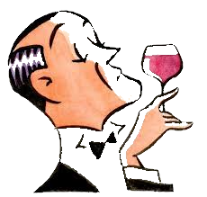

<h1 style="line-height:60px;">Wine Quality Snobs</h1>
Building a wine classifier for wine makers to help plan physiochemical changes in wine making process.

* classification model for red one for white and try a combo (to show improved accuracy)
* supervised learning problem - have the labels

Can we help make the perfect wine?

Data: [www3.dsi.uminho.pt/pcortez/wine/](http://www3.dsi.uminho.pt/pcortez/wine/)

Input variables (based on physicochemical tests): 
1. fixed acidity
2. volatile acidity
3. citric acid
4. residual sugar
5. chlorides
6. free sulfur dioxide
7. total sulfur dioxide
8. density
9. pH
10. sulphates
11. alcohol

Output variable (based on sensory data):
 
12. quality (score between 0 and 10)

## Purpose 

* The Thought: How do we help make wine better? Can we aid winemakers in their pursuit of making better wine?
* Available Data: The Wine Quality dataset which is a study of Red/White Vino Verde grapes from Pablo Cortez et Al
* RND: See what models have been run/executed and find some that haven't in an attempt to make a more accurate model with igher levels of predictability
* Final Idea: Let's choose a predictive model that will help winemakers make better wine!

## The Data: How it Looks

## Preprocessing
* Created 2 bins based on quality levels 1-5 and 6-10 to help evenly spread the data  

* Checked outliers with box/whisper plots and decided to keep the outliers for the red wine and remove the ones from the white set. The white wine had more data so the accuracy went up without the outliers however the red data was a bit lacking and needed the outliers to help raise our predictability.

* Scaled the data to normalize the values in each feature  

## Model Selection

* After trying 3 bins vs 2 we settled on 2 bins for our binary categorization using the ExtraTreesClassifier  
* Red Wine  

* White Wine  

## The App
* Who are we trying to help? Winemakers first and consumers second
* How do we want to do it? Create a machine learning algorithm to help predict the quality outcome of a wine base of 11 physiochemical properties and deploy it to a website for winemakers to be able to tweak their recipes
* The goal? To improve wine quality around the world, make winemakers lifes easier and improve the final product for the consumers
* Tech Used:
 - Python
 - HTML
 - SQLITE
 - Pickle
 - CSS/Bootstrap
 - Heroku
 - Flask
 - Pandas
 - SKLearn
 - Keras Tensorflow
 ## How it ran  
 
  
 
  
 
  
 
  
 
  
 

## [The Demo](https://wine-quality-snobs.herokuapp.com/)
* CLICK IT!

